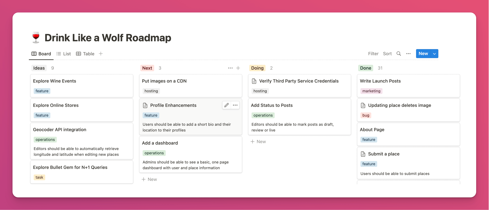

A few days ago, I launched [Drink Like a Wolf](https://drinklikeawolf.com/), a community to help people discover natural wine makers and places. I found out that discipline and deadlines actually work, prioritising is hard, creating quality content is harder, and marketing early is a must.

## A bit of background

[Natural wines](https://drinklikeawolf.com/about) are made by "indie" winemakers in small batches, typically without any intervention in the vineyard or winery. This [growing niche](https://trends.google.com/trends/explore/TIMESERIES/1677852000?hl=en-US&tz=-480&date=all&q=%2Fm%2F02qxpcz&sni=3) has come a long way since my first experience in 2016, but even today, there's still surprisingly little information on the web. I thought it would be cool to help people learn more about the makers behind the wines they enjoy, and discover new places to enjoy them. This project also has the potential turn into a little business as a directory or community, while learning Rails and practicing the "shipping muscle".

## Discipline over motivation

At the start of the project, I made a "commitment" (get it?) to make a git commit every day. The first few days were hard, but it progressively got easier, even enjoyable. The simple act of opening the editor with the intention to write code—especially on days when motivation eluded me—had the biggest impact towards making consistent progress.

## The looming deadlines

One month was too short to build most of the things I wanted, but long enough time to build something decent and get feedback. If I didn't set a timeframe, I would likely have taken longer to ship it or not ship at all.

## Priorities, priorities

One of the biggest challenges for a solo entrepreneur is staying focused. Figuring out what is worth building and avoiding rabbit holes is hard. To stay on track, I used a simple Notion board.

Going through the exercise of figuring out which ideas are worth building every week, and focusing on a handful of things every day helped me a lot to stay focused.

Having said that, I'm working on improving on this. For example, I spent two days working on the "design" in Figma. Judging by the final product, I think it's fair to say that this was unncessary.

Finally, I kept a development journal where every Sunday, I highlighted what what I set out to do, whether I accomplished it and how I felt about it. This was a great opportunity for a reality check, as well as to reflect on lessons I learned and celebrate my progress.

## Learning as you go

There's a time and place for structured learning with books and courses, but information sticks much better when combined with practice on a real-world project. Over the past year, I consumed my fair share of literature on Ruby and Rails. On this project I finally started to grasp and gain experience with concepts such as about model scopes, concerns, stimulus controllers and mosty importantly, tests. "Just in time learning" in the context of a specific task worked much better than "just learning".

## Content is hard

As much as I am interested in the domain, curating, writing, editing and optimising content takes a lot of effort. Also, building content-heavy businesses take a long time to produce results. Without a plan for consistently creating high quality content, this is probably not be the best business model for an solo entrepreneur to pursue. Although the jury is still out on this, and I would like to be proven wrong.

## Start marketing early

Ironically, as a marketer, I could have done a better job of marketing. Talking about the product while building it helps get some early feedback and gauge interest. It can also help to build an audience. I spent most of my time building and not enough time on talking about it.

## What's next?

I'm quite happy with how this project turned out. I will continue to build functionality and add content from time to time, but I consider this project done for now. For the next set of projects, I will explore less content driven, more saas business ideas. Most importantly, I want to keep the momentum going, by sticking to daily and consistent progress.
